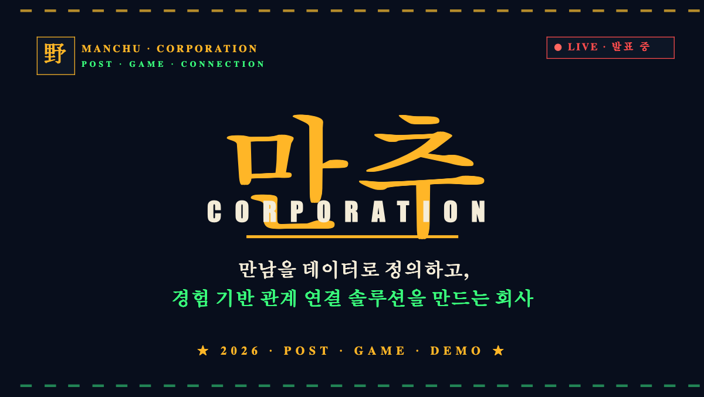

# 야만추 / Yamanchu

> 우리는 사람을 상품처럼 진열하지 않는다.  
> 관계가 생길 수 있는 상황을 무대처럼 만든다.

야만추는 **야구장에서 만남을 추구하다**의 줄임말입니다.  
기존 데이팅 앱처럼 사진과 프로필을 넘기며 사람을 고르는 서비스가 아니라, 야구 직관이라는 강한 공동 경험 안에서 **같은 공간, 같은 순간, 같은 감정**을 공유한 사람들을 연결하는 소셜 매칭 MVP입니다.

이 저장소는 만추 Corporation의 첫 번째 서비스인 야만추를 설명하는 발표자료, 기획서, 그리고 3개의 발표용 데모를 포함합니다.

## 기존 데이팅 앱의 문제

대부분의 데이팅 앱은 사람을 정적인 프로필로 판단하게 만듭니다.

- 사진이 매력적인가
- 나이, 직업, 지역이 조건에 맞는가
- 취미 키워드가 비슷한가
- 짧은 자기소개가 그럴듯한가

하지만 실제 관계는 프로필만으로 만들어지지 않습니다.  
관계가 시작되는 순간에는 보통 **같은 상황을 겪고, 같은 순간에 반응하고, 그 감정이 대화로 이어지는 경험**이 있습니다.

기존 데이팅 앱은 이 경험 데이터를 거의 보지 못합니다.  
그래서 사람을 연결한다고 말하지만, 실제로는 사람을 카드처럼 진열하고 사용자가 빠르게 소비하게 만드는 구조에 가깝습니다.

야만추는 이 질문에서 출발합니다.

> 누가 더 좋아 보이는가?  
> 가 아니라,  
> **누가 나와 같은 순간을 함께 즐길 수 있는가?**

## 만추 Corporation의 관점

만추 Corporation은 만남을 단순한 매칭으로 보지 않습니다.

사람은 하나의 **노드**이고, 만남은 노드와 노드 사이에 생기는 **관계 가능성의 가중치**입니다.  
중요한 것은 "이 사람이 좋은 사람인가?"가 아니라, **"이 사람과 나 사이에 관계가 생길 가능성이 얼마나 높은가?"**입니다.

그 가능성은 다음과 같은 경험 데이터에서 더 잘 드러납니다.

- 같은 공간에 있었는가
- 같은 순간에 반응했는가
- 같은 감정을 공유했는가
- 이후 대화가 자연스럽게 이어졌는가
- 오프라인 경험으로 확장될 수 있는가

만추 Corporation은 만남 시장을 단순 데이팅 시장이 아니라 **관계 가능성의 조율 시장**으로 봅니다.

## 만추 Framework

만추는 하나의 앱 이름이 아니라, 여러 취미와 상황에 적용 가능한 관계 경험 프레임워크입니다.

| 서비스 | 의미 | 관계 데이터 |
| --- | --- | --- |
| 야만추 | 야구장에서 만남 추구 | 직관 반응, 응원 리듬, 경기 후 대화 |
| 축만추 | 축구장에서 만남 추구 | 경기 몰입도, 응원 타이밍, 팀 팬덤 |
| 배만추 | 배드민턴에서 만남 추구 | 협동 방식, 승부욕, 운동 매너 |
| 요만추 | 요리에서 만남 추구 | 취향 표현, 대화 스타일, 공동 작업 |
| 애만추 | 애니메이션에서 만남 추구 | 콘텐츠 취향, 감정 몰입 패턴 |
| 메만추 | 메타버스 아카데미 적용 사례 | 가상 공간 상호작용, 참여 패턴 |

핵심은 **성향 카드의 이동성과 데이터의 누적성**입니다.  
야만추에서 발급받은 "클러치 응원형" 카드가 축만추로 이동하면 축구 경기에서의 반응 데이터가 더해지고, 배만추로 이동하면 협동 플레이 데이터가 추가됩니다.

즉, 사용자의 카드는 가입할 때 한 번 만들고 끝나는 프로필이 아니라, 여러 경험을 지나며 진화하는 **라이브 성향 카드**입니다.

## 왜 야구장인가

스포츠 경기장은 감정의 흐름이 선명하게 드러나는 공간입니다.  
특히 야구장은 홈런, 역전 찬스, 9회말 위기, 응원가, 파도타기, 경기 후 후토크처럼 사람의 반응이 자연스럽게 드러나는 순간이 많습니다.

야만추에서 야구장은 단순한 배경이 아닙니다.  
관계가 생길 수 있도록 설계된 **무대**입니다.

## 첫 번째 서비스: 야만추

야만추는 야구 직관 기반 소셜 매칭 서비스입니다.

기존 데이팅 앱이 사진과 프로필 텍스트를 기반으로 사람을 판단한다면, 야만추는 경기 중 실제 감정 반응을 기반으로 사람을 연결합니다.

- 홈런이 나왔을 때 같이 환호하는지
- 응원 파도타기 때 같은 타이밍에 반응하는지
- 지루한 경기 구간에서 어떻게 분위기를 유지하는지
- 9회말 위기 상황에서 얼마나 몰입하는지
- 경기 후 자연스럽게 대화가 이어지는지

이 데이터는 사용자의 성향 카드에 계속 반영됩니다.  
야만추의 성향 카드는 정적인 프로필이 아니라, 실제 경기 경험을 통해 업데이트되는 관계 데이터입니다.

## 발표 구성

아래는 발표 스크립트 흐름에 맞춘 슬라이드별 설명입니다.

### Slide 1. 만추 Corporation

**핵심 문구**  
만남을 데이터로 정의하고, 관계 가능성을 조율하는 회사

**설명**  
만추 Corporation은 단순한 데이팅 앱 회사가 아닙니다. 사람과 사람이 같은 공간에 있었는지, 같은 순간에 반응했는지, 같은 감정을 공유했는지, 그리고 이후 관계가 이어졌는지를 데이터로 해석합니다.

### Slide 2. 만남이란 무엇인가?

**핵심 문구**  
사람은 하나의 노드이고, 만남은 노드와 노드 사이에 생기는 관계의 가중치다.

**설명**  
기존 시장은 사람을 개체 단위로 평가합니다. 만추는 사람 자체보다 두 사람 사이에 생길 수 있는 관계 가능성에 집중합니다. 그래서 만남 시장을 "관계 가능성의 조율"로 리포지셔닝합니다.

### Slide 3. 만추 Framework

**핵심 문구**  
하나의 카드는 여러 경험을 지나며 진화한다.

**설명**  
야만추는 만추 Framework의 첫 서비스입니다. 축만추, 배만추, 요만추, 애만추로 확장될 수 있으며, 각 서비스에서 쌓인 경험 데이터는 하나의 성향 카드에 누적됩니다.

### Slide 4. 왜 스포츠 직관인가?

**핵심 문구**  
스포츠는 응축된 감정 에너지를 안전하게 표출하는 사회적 창구다.

**설명**  
스포츠 경기장에서는 환호, 아쉬움, 긴장, 몰입이 자연스럽게 드러납니다. 야구장은 그 감정의 리듬이 특히 선명하고, 경기 전/중/후의 관계 경험을 설계하기 좋은 공간입니다.

### Slide 5. 첫 번째 서비스: 야만추

**핵심 문구**  
사진과 프로필이 아니라 경기 중 감정 반응으로 연결한다.

**설명**  
야만추는 야구장에서의 실제 반응을 기반으로 사람을 연결합니다. 같은 경기를 보고, 같은 순간에 반응하고, 경기 후 대화로 이어지는 흐름 자체가 핵심 경험입니다.

### Slide 6. User Flow Architecture

**핵심 문구**  
성향 카드 발급 -> 야구장 오픈월드 -> NPC 상호작용 -> 밸런스 게임 -> 직관 응원석 -> 감정 동조율 리포트 -> 경기 후 연결

**설명**  
야만추의 흐름은 단순 매칭이 아닙니다. 경기 전 성향 카드, 경기 중 응원 반응, 경기 후 연결까지 이어지는 관계 경험 아키텍처입니다.

### Slide 7. Demo 구현

**핵심 문구**  
핵심 경험이 끊기지 않는 단독 시연형 MVP

**설명**  
이번 MVP는 발표자가 직접 시연할 수 있도록 구성했습니다. 실제 로그인, 결제, KBO API, GPT API, 멀티플레이는 제외했지만, 성향 카드, 오픈월드, 밸런스 게임, 응원석, 감정 리포트, 경기 후 연결 흐름은 끊기지 않게 구현했습니다.

### Slide 8. 직관 Pain Point 해결

**핵심 문구**  
야만추는 매칭 앱을 넘어 직관 경험 자체를 개선하는 서비스로 확장된다.

**설명**  
근처 성향 매칭 알림, 좌석 기반 음식 배달, 구단 마스코트 다마고치 같은 기능으로 직관 현장의 불편을 해결하고, 제휴와 광고 기반 수익 모델로 확장할 수 있습니다.

### Slide 9. 비수기 공략

**핵심 문구**  
야구 비수기에는 사용자를 다른 만추 서비스로 라우팅한다.

**설명**  
야구 비수기인 11월부터 2월까지 사용자가 이탈하는 대신, 축만추나 배만추 같은 다른 서비스로 이동할 수 있습니다. 야만추에서 쌓인 성향 데이터는 다른 취미 서비스에서도 이어집니다.

### Slide 10. Closing

**핵심 문구**  
우리는 사람을 상품처럼 진열하지 않는다. 관계가 생길 수 있는 상황을 무대처럼 만든다.

**설명**  
만추 Corporation은 관계가 생길 조건을 발견하고, 그 가능성이 자연스럽게 커지도록 설계합니다. 야만추는 그 첫 번째 적용 사례입니다.

## 데모 구성

| Folder | Demo | Description |
| --- | --- | --- |
| `1-yamanchu-mvp-3d` | MVP 3D Demo | 성향 카드 발급, 3D 야구장, NPC 상호작용, 밸런스 게임, 채팅, 결제 Mock |
| `2-yamanchu-live-demo` | Live Cheering Demo | 경기 타임라인, 이모티콘 반응, 파도타기, 예측 배팅, 홈런 연출, 감정 리포트 |
| `3-yamanchu-postgame-demo` | Post-Game Demo | 경기 후 코스 추천, AI 상담 Mock, 정모 커뮤니티, 제휴 결제 Mock |
| `archive/yamanchu-mvp-3d-legacy` | Legacy Demo | 이전 MVP 변형 보존 |

## 실행 방법

각 데모 폴더에서 의존성을 설치하고 Vite 개발 서버를 실행합니다.

```bash
cd 1-yamanchu-mvp-3d
npm install
npm run dev
```

```bash
cd 2-yamanchu-live-demo
npm install
npm run dev -- --port 5183
```

```bash
cd 3-yamanchu-postgame-demo
npm install
npm run dev
```

## 발표 자료

### 슬라이드 미리보기

| Yamanchu Day 1 | Manchu Corporation Day 2 | Manchu Corporation Demo |
| --- | --- | --- |
| [](docs/ko/presentations/야만추_Day1_ppt.pptx) | [](docs/ko/presentations/만추_Corporation_Day2.pptx) | [](3-yamanchu-postgame-demo/만추_Corporation_Demo.pptx) |

- [야만추 Day 1 발표자료](docs/ko/presentations/야만추_Day1_ppt.pptx)
- [만추 Corporation Day 2 발표자료](docs/ko/presentations/만추_Corporation_Day2.pptx)
- [만추 Corporation Demo 발표자료](3-yamanchu-postgame-demo/만추_Corporation_Demo.pptx)
- [만추 Corporation 발표 스크립트](docs/ko/presentations/manchu_corporation_presentation_script.md)
- [야만추 기획서](docs/ko/planning/야만추_기획서.docx)

## MVP 구현 범위

이 저장소의 데모는 발표용 프로토타입입니다.

- 프론트엔드 단독 구현
- 실제 로그인 없음
- 실제 결제 없음
- 실제 KBO API 연동 없음
- 실제 GPT API 호출 없음
- 실시간 멀티플레이 없음
- 발표 흐름 검증을 위한 Mock 데이터 사용

---

# English Version

## Yamanchu

> We do not display people like products.  
> We design situations where relationships can naturally emerge.

Yamanchu means **"seeking connection at a baseball stadium."**  
It is not a dating app where users judge people by photos and static profile text. Yamanchu is a social matching MVP that connects people through a shared live baseball experience: **same place, same moment, same emotion**.

This repository contains the presentation decks, planning document, script, and three frontend demos for Yamanchu, the first service from Manchu Corporation.

## The Problem With Existing Dating Apps

Most dating apps ask users to evaluate people through static profile signals.

- Is the photo attractive?
- Do age, job, and location match my conditions?
- Do we share similar hobby keywords?
- Does the short bio sound appealing?

But real relationships rarely begin from profile data alone.  
They often begin when two people go through the same situation, react to the same moment, and turn that shared emotion into conversation.

Existing dating apps miss this experience data.  
They claim to connect people, but structurally they often display people like cards and encourage fast consumption.

Yamanchu starts from a different question.

> Not "Who looks better?"  
> but  
> **"Who can enjoy the same moment with me?"**

## Manchu Corporation's View

Manchu Corporation does not define connection as simple matching.

A person is a **node**, and a meeting is the **weighted relationship potential** between two nodes.  
The important question is not "Is this person good?" but **"How likely is it that a relationship can form between this person and me?"**

That potential is better captured through experience data.

- Were we in the same place?
- Did we react to the same moment?
- Did we share the same emotion?
- Did the conversation continue naturally afterward?
- Can the connection expand into an offline experience?

Manchu Corporation repositions the meeting market as a market for **orchestrating relationship potential**, not just dating or community discovery.

## The Manchu Framework

Manchu is not just one app. It is a relationship-experience framework that can be applied across different hobbies and social contexts.

| Service | Meaning | Relationship Data |
| --- | --- | --- |
| Yamanchu | Seeking connection at baseball games | Live reactions, cheering rhythm, post-game conversation |
| Chukmanchu | Seeking connection at soccer games | Match immersion, cheering timing, team fandom |
| Baemanchu | Seeking connection through badminton | Cooperation style, competitiveness, sportsmanship |
| Yomanchu | Seeking connection through cooking | Taste expression, conversation style, collaboration |
| Aemanchu | Seeking connection through animation | Content preference, emotional immersion patterns |
| Memanchu | Metaverse academy application case | Virtual-space interaction, participation patterns |

The key idea is **card portability and data accumulation**.  
A "clutch cheering type" card issued in Yamanchu can move into Chukmanchu, where soccer match reactions are added. It can then move into Baemanchu, where cooperation and play-style data are added.

The card is not a one-time profile.  
It is a **live personality card** that evolves through multiple shared experiences.

## Why Baseball Stadiums

Sports stadiums are one of the clearest places to observe emotional flow.  
Baseball is especially useful because it has visible moments of tension and release: home runs, comeback chances, bottom-of-the-ninth pressure, chants, stadium waves, and post-game conversation.

In Yamanchu, the baseball stadium is not just a background.  
It is a **stage designed for relationships to emerge**.

## The First Service: Yamanchu

Yamanchu is a baseball-stadium-based social matching service.

Instead of connecting people through photos and profile text, Yamanchu connects people through emotional reactions during the game.

- Did we cheer together when a home run happened?
- Did we react at the same timing during the stadium wave?
- How did we keep the mood during a slow inning?
- How immersed were we during a ninth-inning crisis?
- Did the conversation continue naturally after the game?

These signals continuously update the user's personality card.  
Yamanchu's card is not a static profile. It is relationship data updated by real stadium experience.

## Presentation Flow

### Slide 1. Manchu Corporation

**Core Message**  
A company that defines meetings as data and orchestrates relationship potential.

**Explanation**  
Manchu Corporation is not just a dating app company. It interprets whether people were in the same space, reacted to the same moment, shared the same emotion, and continued the relationship afterward.

### Slide 2. What Is a Meeting?

**Core Message**  
A person is a node, and a meeting is the weighted relationship potential between nodes.

**Explanation**  
Existing services evaluate people as individual objects. Manchu focuses on the relationship potential between two people and reframes the market around orchestrating that potential.

### Slide 3. Manchu Framework

**Core Message**  
One card evolves as it passes through multiple experiences.

**Explanation**  
Yamanchu is the first service in the Manchu Framework. The same card can expand into soccer, badminton, cooking, animation, and metaverse contexts while accumulating new experience data.

### Slide 4. Why Live Sports?

**Core Message**  
Sports are a social outlet where compressed emotional energy can be expressed safely.

**Explanation**  
Sports stadiums naturally reveal joy, disappointment, tension, and immersion. Baseball provides a strong rhythm for designing relationship experiences before, during, and after the game.

### Slide 5. First Service: Yamanchu

**Core Message**  
Connect through emotional reactions during the game, not photos and profiles.

**Explanation**  
Yamanchu connects people through real reactions at the stadium. Watching the same game, reacting to the same moment, and continuing the conversation afterward is the core experience.

### Slide 6. User Flow Architecture

**Core Message**  
Personality card -> baseball open world -> NPC interaction -> balance game -> live cheering seats -> emotional sync report -> post-game connection

**Explanation**  
Yamanchu is not a single matching screen. It is a relationship experience architecture that connects pre-game identity, in-game reactions, and post-game offline continuation.

### Slide 7. Demo Implementation

**Core Message**  
A standalone MVP where the core experience does not break.

**Explanation**  
The demo excludes real login, payment, KBO API, GPT API, and live multiplayer. Instead, it preserves the full narrative flow: personality card, open world, balance game, cheering seat, emotional report, and post-game connection.

### Slide 8. Solving Stadium Pain Points

**Core Message**  
Yamanchu can expand beyond matching into improving the live stadium experience itself.

**Explanation**  
Future features can include nearby personality-match alerts, seat-based food delivery, and team mascot companion mechanics, enabling partnership and advertising revenue models.

### Slide 9. Off-Season Strategy

**Core Message**  
During baseball's off-season, users can be routed into other Manchu services.

**Explanation**  
Instead of losing users from November to February, Yamanchu can move users into Chukmanchu, Baemanchu, or other services while carrying over their accumulated personality data.

### Slide 10. Closing

**Core Message**  
We do not display people like products. We design situations where relationships can naturally emerge.

**Explanation**  
Manchu Corporation identifies the conditions under which relationships can form and designs experiences that increase that possibility. Yamanchu is the first application of that framework.

## Demo Structure

| Folder | Demo | Description |
| --- | --- | --- |
| `1-yamanchu-mvp-3d` | MVP 3D Demo | Personality card, 3D stadium, NPC interaction, balance game, chat, mock payment |
| `2-yamanchu-live-demo` | Live Cheering Demo | Timeline, emoji reaction, stadium wave, prediction betting, home run sequence, emotional report |
| `3-yamanchu-postgame-demo` | Post-Game Demo | Post-game course recommendation, AI consultation mock, meetup community, partner payment mock |
| `archive/yamanchu-mvp-3d-legacy` | Legacy Demo | Preserved earlier MVP variant |

## Run

Install dependencies and run the Vite dev server inside each demo folder.

```bash
cd 1-yamanchu-mvp-3d
npm install
npm run dev
```

```bash
cd 2-yamanchu-live-demo
npm install
npm run dev -- --port 5183
```

```bash
cd 3-yamanchu-postgame-demo
npm install
npm run dev
```

## Presentation Materials

### Slide Previews

| Yamanchu Day 1 | Manchu Corporation Day 2 | Manchu Corporation Demo |
| --- | --- | --- |
| [](docs/ko/presentations/야만추_Day1_ppt.pptx) | [](docs/ko/presentations/만추_Corporation_Day2.pptx) | [](3-yamanchu-postgame-demo/만추_Corporation_Demo.pptx) |

- [Yamanchu Day 1 deck](docs/ko/presentations/야만추_Day1_ppt.pptx)
- [Manchu Corporation Day 2 deck](docs/ko/presentations/만추_Corporation_Day2.pptx)
- [Manchu Corporation demo deck](3-yamanchu-postgame-demo/만추_Corporation_Demo.pptx)
- [Manchu Corporation presentation script](docs/ko/presentations/manchu_corporation_presentation_script.md)
- [Yamanchu planning document](docs/ko/planning/야만추_기획서.docx)

## MVP Scope

This repository contains presentation prototypes.

- Frontend-only implementation
- No real login
- No real payment
- No KBO API integration
- No GPT API call
- No real-time multiplayer
- Mock data used to validate the presentation flow
